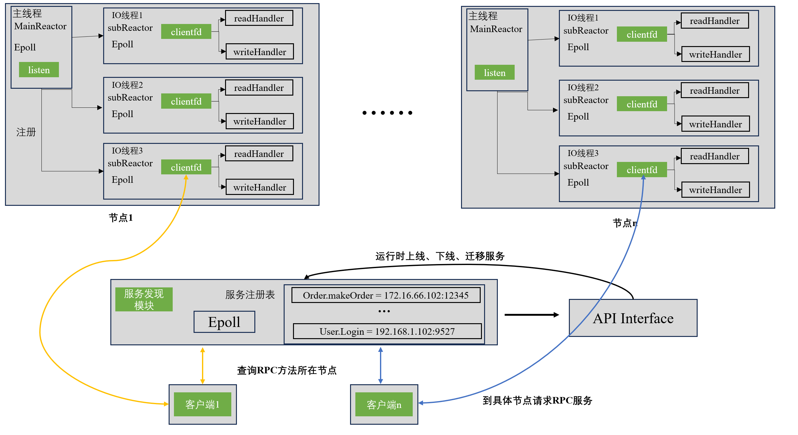

# TaLonRPC:基于epoll+protobuf的分布式高可用RPC框架

* **支持分布式部署**
* **手写服务发现(stand alone)模块(提供运行时服务发现模块交互API)**
* **实现节点宕机重启的高可用功能**
* **实现RPC请求、日志、定时器、均采用异步方式实现。**

-------
## TaLonRPC:架构图

## 目录介绍
* bin/   可执行程序，即包括服务发现模块，用户自定义RPC服务模块
* common/ 一些工具类源码
* conf/ 配置文件，主要包括RPC服务所部署的端口、日志信息、IO线程数等
* lib/ 静态库，整个RPC框架打包成静态库可供用户部署
* log/ 日志
* net/ 核心代码
* test/ 测试代码，模拟用户如何使用该框架
----
## 环境
```
ubuntu  Ubuntu 20.04.6 LTS
C++ 17
依赖库：inyxml pthread protobuf
```

## How to use?

* 1.在conf/service_center.conf中 配置服务发现模块的IP以及端口号
``` cmake
#服务发现中心所运行在的ip
serivce_center_ip = 172.16.66.102

#服务发现中心运行在的两个端口

#query_port
#向服务发现中心查询rpc服务方法所在的哪台主机
query_port  =   8080  
#control_port 用于 
#通过TalonRPC框架提供的第三方API用于实时操作服务中心的端口
control_port = 9090
```
* 2.可在conf/talon.xml中更改RPC服务节点运行时端口以及IO线程数等
```html
...
  <server>
    <port>9999</port>
    <io_threads>4</io_threads>
    <local_ip>172.16.66.102</local_ip>
  </server>

 ...
```

* 3.如test/目录的例子那样，用户需要完成protobuf文件，your_rpc_server.cc 和your_rpc_client.cc，然后在根目录中的CMakeLists.txt中末尾补充上用户自己的目录
```
add_subdirectory(test)
```
```
  test/
    ├── CMakeLists.txt
    ├── order.pb.cc
    ├── order.pb.h
    ├── order.proto
    ├── test_rpc_client.cc
    └── test_rpc_server.cc

```

* 4.构建cmake
```
mkdir build && cd build
cmake ..
```
* 编译,make之后可执行文件位于 bin/
```
make
```
```
此时bin目录结构如下
  bin/
    ├── rpc_client
    ├── rpc_server
    ├── rpc_service_discovery
    └── test_interface

lib目录已经生成静态库
  lib/
    └── libtalon_rpc.a
```
-----

* 5.配置文件配置完成之后首先启动服务发现模块
```
./bin/rpc_service_discovery
```
> 服务发现接口runtime API接口:在启动rpc_service_discovery之后可以通过API 任意操作rpc_service_discovery中的数据。也因此可以在线对分布式集群中的节点服务进行灵活的更改，上线与下线；例如net/service_discovery/test_run_time_sd_interface.cc中：
``` C++ 
#include "run_time_service_discovery_interface.h"
#include "iostream"
int main(){
    // 这里的9090 参考前面的步骤1
    Runtime_Command command("127.0.0.1",9090);
    // 可手动添加删除某一台节点的服务方法
    /*
        Order.makeOrder为.proto文件中定义的rpc方法
        "127.0.0.1":12345 为该方法被发布在哪一个节点上
    */
    std::cout <<command.add_service("Order.makeOrder","127.0.0.1",12345) .get_info() <<std::endl;
   // std::cout <<command.delete_service("Order.queryOrder").get_info() <<std::endl;
    std::cout <<command.look_up() .get_info() <<std::endl;
}
```

* 6.在上述配置好之后可以发布用户RPC服务(test/test_rpc_server.cc测试用例)
``` shell
bin/rpc_server 
```
> 当服务发现中心启动后，服务端运行时会根据用户的RPC方法所部署的节点自动向服务中心注册该RPC方法所在的节点。
```c++
// test/test_rpc_server.cc : main()
talon::Config::SetGlobalConfig("../conf/talon.xml");
talon::Config::setServiceCenterMap("../conf/service_center.conf");
talon::Logger::InitGlobalLogger();
std::shared_ptr<OrderImpl> service = std::make_shared<OrderImpl>();
talon::RpcDispatcher::GetRpcDispatcher()->registerService(service);
```

> 服务正常启动后会看到日志信息：
```
LOG -- CONFIG LEVEL[DEBUG], FILE_NAMELOG -- CONFIG LEVEL[DEBUG], FILE_NAME[test_rpc_server_log],FILE_PATH[/home/cdy/code/projects/RPC/TalonRPC/log/] MAX_FILE_SIZE[1000000000 B], SYNC_INTEVAL[500 ms]
Server -- PORT[9999], IO Threads[4]
Init log level [DEBUG]
local_ip= 172.16.66.102,port = 9999
            ...
[INFO]  [23-10-23 15:46:00.848] [609133:609133] [/home/cdy/code/projects/RPC/TalonRPC/net/eventloop.cc:70]      succ create event loop in thread 609133
[INFO]  [23-10-23 15:46:00.849] [609133:609133] [/home/cdy/code/projects/RPC/TalonRPC/net/rpc/rpc_dispatcher.cc:175]   success [Order.makeOrder] register service discovery center : [172.16.66.102:9999]
[INFO]  [23-10-23 15:46:00.849] [609133:609133] [/home/cdy/code/projects/RPC/TalonRPC/net/rpc/rpc_dispatcher.cc:175]    success [Order.queryOrder] register service discovery center : [172.16.66.102:9999]
...
...
```

----

* 7.测试用户的rpc_client文件
```
bin/rpc_client
```
>说明:客户端会通过第1步的用于客户端的服务发现端口根据请求调用的rpc方法名自动查询该方法所在的节点。因此client用户程序中不需要指明端口号.

----
## 提供分布式情况RPC服务发布方的高可用模式

高可用:当服务进程崩溃时，可自动重启RPC服务，可设置重启次数，若超过重启次数，若再度崩溃，则放弃重启
```c++
#include "high_availability.h"
...
int main(int argc,char* argv[]){
    ... // 日志等其他信息的初始化
    
    auto start_service_func = [&]() {
        talon::IPNetAddr::s_ptr addr = std::make_shared<talon::IPNetAddr>(
                talon::Config::GetGlobalConfig()->m_local_ip,
                talon::Config::GetGlobalConfig()->m_port);
        talon::TcpServer tcp_server(addr);
        tcp_server.start();
    };
    // 开启高可用模式
    HighAvai* high_avai = HighAvai::getInstance(start_service_func);
    high_avai->setRestartCount(10/* defalut count = 5；*/);
    high_avai->start(argc,argv);
    return 0;
    
}

```


